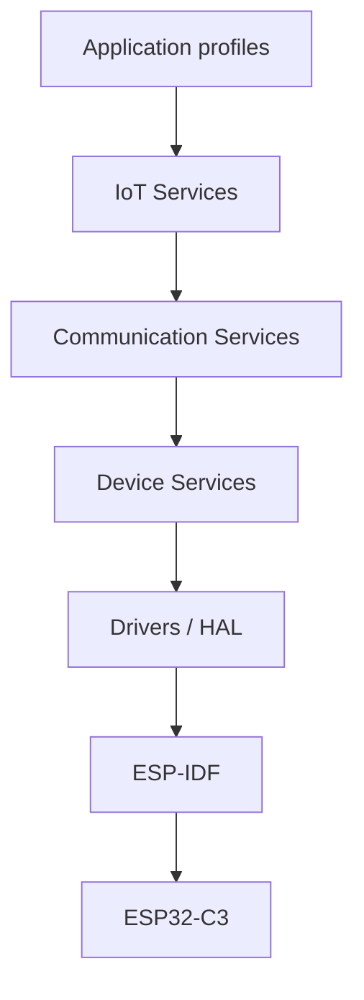

# System architecture

## Layered model

### Interface ownership

| From | To | Headers | Notes |
| --- | --- | --- | --- |
| Application | IoT services | `iot_profile.h`, `iot_services.h` | No ESP-IDF includes |
| IoT services | Communication | `iot_mqtt.h`, `iot_ble.h`, `iot_wifi.h` | Commands validated first |
| Communication | Device | `iot_config.h`, `iot_security.h`, `iot_ota.h` | NVS + TLS bundle |
| Device | HAL | `iot_drivers.h`, `iot_board.h` | Thread-safe, mutex owned |
| HAL | ESP-IDF | `driver/*`, `esp_adc`, NimBLE, `esp_wifi` | Conversion to `iot_err_t` |

## Task architecture

| Task | Prio | Stack | Blocking sync | Produced data |
| --- | --- | --- | --- | --- |
| wdt | 14 | 2048 | 2 s delay | WDT pet |
| sensor | 12 | 4096 | `sensor_isr_sem` | `sample_q` |
| cmd | 11 | 4096 | `command_q` | HAL writes |
| ble host | NimBLE | IDF | events | `command_q` (timeout 0) |
| wifi | IDF events | IDF | event loop | `IOT_EVT_WIFI_IP` |
| mqtt_pump | 8 | 4096 | `telemetry_q` | broker publish |
| proc | 7 | 4096 | `sample_q` | `telemetry_q` |
| storage/config | caller | — | mutex | NVS |
| ota | 4 | 8192 | HTTPS | reboot |
| diag | 3 | 3072 | 5 s | snapshot |

## Data-flow architecture

**Uplink:** Sensor ISR/Driver → Sensor task → `sample_q` → Processing → `telemetry_q` → MQTT task → TLS broker → Cloud.

**Downlink:** Cloud → MQTT callback (no parse) → `command_q` → Command task → `iot_security_validate_command` → profile/HAL.

**ISR:** GPIO ISR → `iot_sem_give_from_isr` → Sensor task. No log/malloc/lock in ISR.

## Communication architecture

- BLE 5 NimBLE peripheral: commissioning + sensor notify.
- Wi-Fi STA: WPA2/WPA3, exponential reconnect (event-driven).
- MQTT 3.1.1 over TLS 1.2, cert bundle, QoS1 telemetry, keepalive 30 s.
- Cloud profiles: generic MQTTS, AWS IoT, Azure IoT Hub, GCP-compatible self-managed MQTT (IoT Core is deprecated).

## Error-handling architecture

All public functions return `iot_err_t`. HAL maps `esp_err_t` via `iot_err_from_esp`. Failures increment `iot_diag` counters. Actuator commands that fail validation never reach GPIO.

## Diagnostics architecture

`iot_diag_event` from tasks; `iot_diag_isr_bump` from ISR. Snapshot JSON can be published on `device/{id}/diagnostics`.

## Security architecture

No production credentials in source. NVS namespace `iot`. TLS via ESP-IDF certificate bundle. BLE SM with bonding + MITM flags (Just Works IO cap — raise IO cap for production pairing). MQTT commands require JSON object/array or known BLE opcodes. OTA URLs must be `https://`.

## OTA architecture

Dual OTA partitions (`partitions.csv`). `CONFIG_BOOTLOADER_APP_ROLLBACK_ENABLE`. Download pets the task WDT. Failure calls `esp_https_ota_abort` so the previous slot remains bootable. `app_main` calls `iot_ota_mark_valid()` after a healthy boot.
