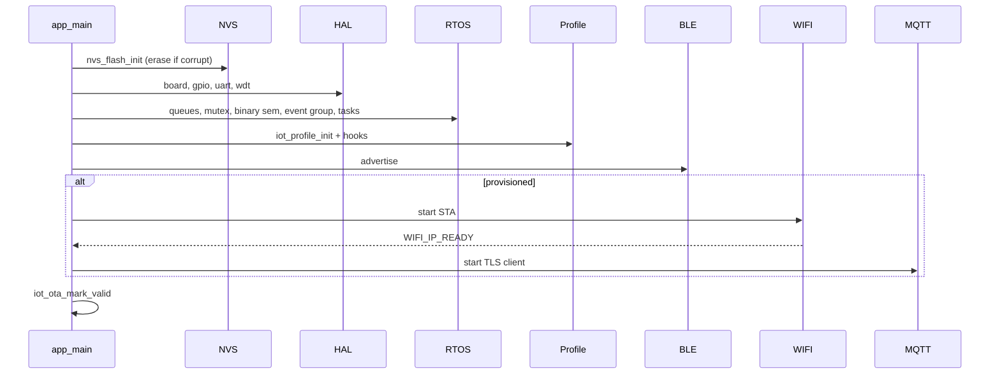
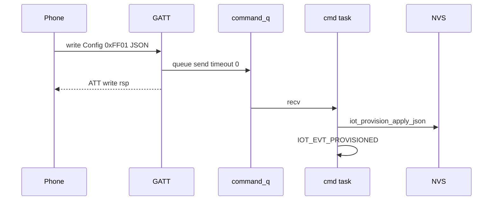
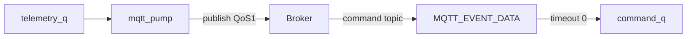

# Boot, Wi-Fi, BLE, MQTT, OTA, fault — sequence diagrams

## Boot

```mermaid
sequenceDiagram
  participant M as app_main
  participant NVS
  participant HAL
  participant RTOS
  participant PROF as Profile
  participant BLE
  participant WIFI
  participant MQTT
  M->>NVS: nvs_flash_init (erase if corrupt)
  M->>HAL: board, gpio, uart, wdt
  M->>RTOS: queues, mutex, binary sem, event group, tasks
  M->>PROF: iot_profile_init + hooks
  M->>BLE: advertise
  alt provisioned
    M->>WIFI: start STA
    WIFI-->>M: WIFI_IP_READY
    M->>MQTT: start TLS client
  end
  M->>M: iot_ota_mark_valid
```

## BLE provisioning

```mermaid
sequenceDiagram
  participant Phone
  participant GATT
  participant Q as command_q
  participant CMD as cmd task
  participant NVS
  Phone->>GATT: write Config 0xFF01 JSON
  GATT->>Q: queue send timeout 0
  GATT-->>Phone: ATT write rsp
  Q->>CMD: recv
  CMD->>NVS: iot_provision_apply_json
  CMD->>CMD: IOT_EVT_PROVISIONED
```

## MQTT

```mermaid
flowchart LR
  T[telemetry_q] --> P[mqtt_pump]
  P -->|publish QoS1| B[Broker]
  B -->|command topic| E[MQTT_EVENT_DATA]
  E -->|timeout 0| C[command_q]
```
